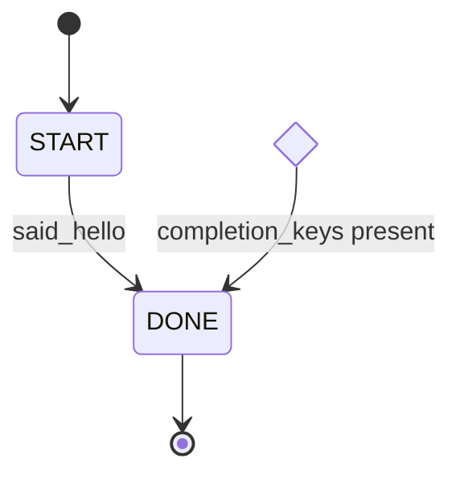
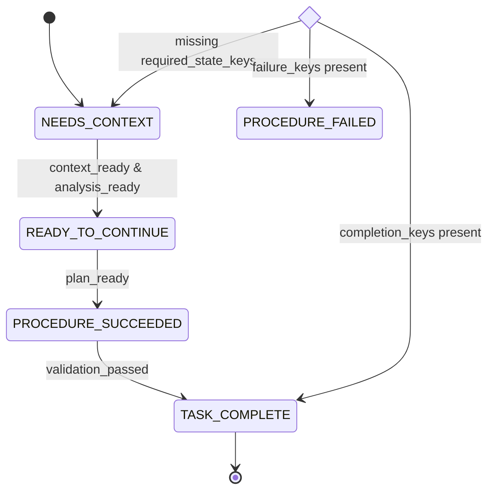
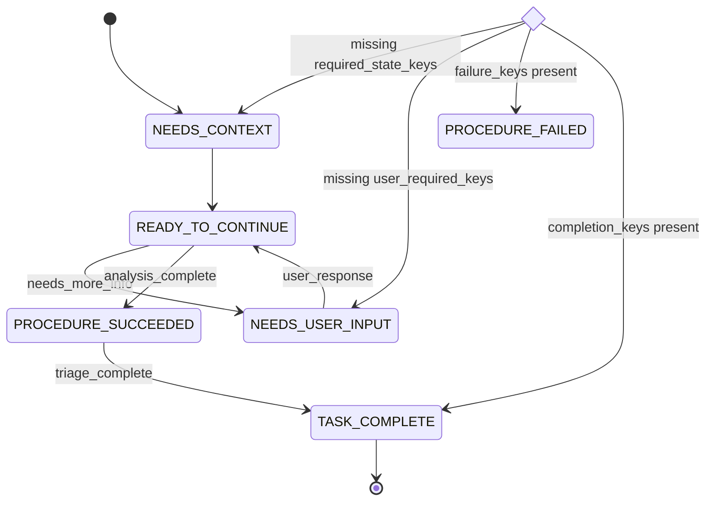
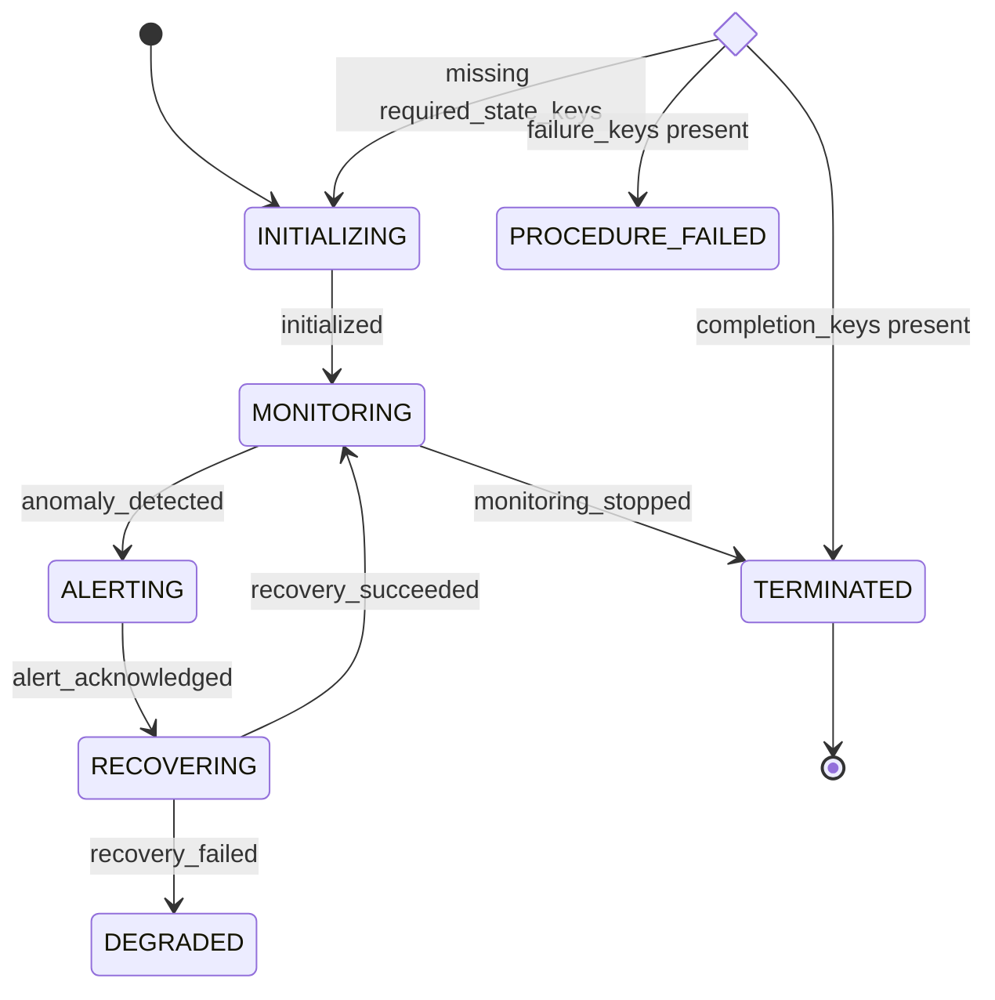

# Slater User Guide

## Designing Deterministic, Explainable Agents

Slater is a framework for building **state-driven AI agents** whose behavior is:

- deterministic
- inspectable
- replayable
- explainable

Instead of writing imperative loops that decide “what to do next,” you **describe the structure of an agent**, and Slater executes that structure safely.

At the center of every Slater agent is a single declarative artifact:

> **The AgentSpec**

---

## 1. What is an AgentSpec?

An **AgentSpec** is a versioned, declarative description of an agent’s behavior.

It defines:

- the **Phases** an agent may occupy
- the **global control constraints** that apply everywhere
- the **rules for transitioning** between phases
- the **procedures** executed while in each phase

It explicitly does **not**:

- execute logic
- mutate state
- embed an FSM engine

An AgentSpec is best thought of as a **runnable system diagram** — one that Slater can validate, visualize, and execute.

---

## 2. Core Concepts

Every Slater agent is defined by four components.

```
AgentSpec =
  Phases
  + ControlPolicy
  + TransitionPolicy
  + Procedures
```

| Component | Responsibility |
|---------|----------------|
| **Phase** | Names *where* the agent is in its lifecycle |
| **ControlPolicy** | Declares global constraints that can preempt normal progression |
| **TransitionPolicy** | Declares how the agent progresses between phases |
| **Procedures** | Define what work is executed while in a phase |

---

## 3. Phases — where the agent is

A **Phase** represents *where the agent is* in its lifecycle.

Phases are defined using `PhaseEnum`, which creates a validated Enum for your agent:

```python
from slater.phases import PhaseEnum

Phase = PhaseEnum.create(
    "START",
    "THINKING",
    "DONE",
    class_name="Phase",
)
```

Phase names must be `UPPER_SNAKE_CASE` and cannot use reserved words (`NONE`, `ANY`, `ALL`, `DEFAULT`, etc.).

### Properties of Phases

- Exactly one Phase is active at a time
- Phases are **persistent**, not instantaneous
- Phases may represent:
  - task steps
  - decision points
  - operational modes

> A Phase is not “something that happened”; it is where the agent currently is.

### How Phases change

Phases change **only in response to Facts** emitted by Actions.

1. A Procedure executes for the current Phase
2. Actions emit Facts describing outcomes
3. Slater evaluates policies against the accumulated Fact set
4. If conditions match, the agent **enters a new Phase**

---

## 4. ControlPolicy — global control constraints

```python
ControlPolicy(
    required_state_keys={...},
    user_required_keys={...},
    completion_keys={...},
    failure_keys={...},
)
```

The **ControlPolicy** declares global constraints that apply from **any Phase**.

Facts emitted by Actions can:

- immediately force a return to a context-gathering Phase
- immediately block execution awaiting user input
- immediately terminate the agent
- immediately enter a failure Phase

ControlPolicy is evaluated **before TransitionPolicy** and may short-circuit normal progression.

---

## 5. TransitionPolicy — how the agent progresses

```python
TransitionPolicy(
    rules=(...),
    default=SomePhase,
)
```

Each transition is declared via a **PhaseRule**:

```python
PhaseRule(
    enter=Phase.SOME_PHASE,
    when_all={...},
    when_any={...},
    when_none={...},
)
```

### PhaseRule semantics

A PhaseRule matches if:

- **all** keys in `when_all` are present
- **at least one** key in `when_any` is present (if provided)
- **none** of the keys in `when_none` are present

Rules are evaluated **in order**. The first matching rule wins.

---

## 6. Procedures — what happens in each Phase

A **Procedure** is a sequence of Actions executed while the agent remains in a Phase.

Actions may:

- read state
- perform work
- emit Facts

Actions must **never** manipulate control flow directly.

---

## 6.1 Execution Semantics — Eager Fact Application

Understanding how Actions execute within a Procedure is critical for writing correct agents.

### Sequential Visibility

Slater uses **eager fact application**: as each Action completes, its emitted Facts are immediately applied to the iteration's state. This means:

```
Procedure([
    GatherContext(),   # Emits: {repo_root: "/path", context_ready: true}
    AnalyzeRepo(),     # Can read repo_root immediately
])
```

`AnalyzeRepo` can access `repo_root` even though both Actions are in the same iteration.

### Implications for Procedure Authors

| Behavior | Implication |
|----------|-------------|
| **Action order matters** | Later Actions can depend on facts from earlier Actions |
| **Failure short-circuits** | If an Action fails, subsequent Actions don't execute |
| **Iteration facts are ephemeral** | Facts with `scope="iteration"` are not persisted |
| **Durable facts accumulate** | Facts with `scope="session"` or `scope="persistent"` survive iterations |

### Fact Scopes

| Scope | Visibility | Persistence |
|-------|------------|-------------|
| `iteration` | Current iteration only | Not persisted |
| `session` | All iterations | Persisted for agent lifetime |
| `persistent` | All iterations | Persisted across agent restarts |

### Phase Transitions Use Only Durable Facts

Phase transitions are derived **only from durable facts** (session + persistent) at iteration boundaries:

```
iteration N:
  1. Execute Procedure (Actions emit facts)
  2. Persist durable facts to StateStore
  3. Derive next Phase from TransitionPolicy

iteration N+1:
  1. Load durable facts from StateStore
  2. Execute Procedure for derived Phase
  ...
```

This ensures **deterministic FSM behavior**: the same durable fact set always produces the same phase transition.

---

## 7. Canonical example — HelloAgent

is a deliberately minimal Slater agent that exists to illustrate the full AgentSpec surface area without introducing domain complexity.

Despite its simplicity, HelloAgent demonstrates all core Slater concepts:
* Phases define the agent’s lifecycle (START → DONE)
* Procedures describe what work occurs in each Phase
* Actions emit Facts that describe outcomes (said_hello)
* TransitionPolicy declares how emitted Facts cause Phase transitions
* ControlPolicy defines global termination semantics

### Phases

```python
from slater.phases import PhaseEnum

Phase = PhaseEnum.create("START", "DONE")
```

* `START` represents the agent's active execution phase.
* `DONE` represents the agent's terminal phase. 

### AgentSpec

```python
hello_spec = AgentSpec(
    name="hello-agent",
    version="1.0.0",
    phases=set(Phase),
    control_policy=ControlPolicy(
        required_state_keys=set(),
        user_required_keys=set(),
        completion_keys={"said_hello"},
        failure_keys=set(),
    ),
    transition_policy=TransitionPolicy(
        rules=(
            PhaseRule(
                enter=Phase.DONE,
                when_all={"said_hello"},
            ),
        ),
        default=Phase.START,
    ),
    procedures={
        Phase.START: ProcedureTemplate(actions=[SayHello()]),
        Phase.DONE: ProcedureTemplate(actions=[]),
    },
)
```

Together, these components demonstrate that even the simplest `slater` agent:

* has explicit structure
* derives control flow from Facts
* separates work execution from state transitions

HelloAgent’s AgentSpec serves as a minimal, canonical example of how `slater` turns agent behavior into a fully specified, inspectable system.

### Diagram



---

# 8. Agent Archetypes

## 8.1 Task Agent — RepoRefactor

### Phases

```python
Phase = PhaseEnum.create(
    "NEEDS_CONTEXT",
    "READY_TO_CONTINUE",
    "PROCEDURE_SUCCEEDED",
    "PROCEDURE_FAILED",
    "TASK_COMPLETE",
)
```

### AgentSpec

```python
repo_refactor_spec = AgentSpec(
    name="repo-refactor",
    version="1.0.0",
    phases=set(Phase),
    control_policy=ControlPolicy(
        required_state_keys={"context_ready", "analysis_ready"},
        user_required_keys=set(),
        completion_keys={"task_complete"},
        failure_keys={"blocked"},
    ),
    transition_policy=TransitionPolicy(
        rules=(
            PhaseRule(
                enter=Phase.READY_TO_CONTINUE,
                when_all={"context_ready", "analysis_ready"},
                when_none={"blocked"},
            ),
            PhaseRule(
                enter=Phase.PROCEDURE_SUCCEEDED,
                when_all={"plan_ready"},
                when_none={"blocked"},
            ),
            PhaseRule(
                enter=Phase.TASK_COMPLETE,
                when_all={"validation_passed"},
            ),
        ),
        default=Phase.NEEDS_CONTEXT,
    ),
    procedures={...},
)
```

### Diagram



---

## 8.2 Decision Agent — IssueTriage

### Phases

```python
Phase = PhaseEnum.create(
    "NEEDS_CONTEXT",
    "READY_TO_CONTINUE",
    "NEEDS_USER_INPUT",
    "PROCEDURE_SUCCEEDED",
    "PROCEDURE_FAILED",
    "TASK_COMPLETE",
)
```

### AgentSpec

```python
issue_triage_spec = AgentSpec(
    name="issue-triage",
    version="1.0.0",
    phases=set(Phase),
    control_policy=ControlPolicy(
        required_state_keys={"issue_loaded", "repo_context_loaded"},
        user_required_keys={"user_response"},
        completion_keys={"triage_complete"},
        failure_keys={"blocked"},
    ),
    transition_policy=TransitionPolicy(
        rules=(
            PhaseRule(
                enter=Phase.NEEDS_USER_INPUT,
                when_any={"needs_more_info"},
            ),
            PhaseRule(
                enter=Phase.PROCEDURE_SUCCEEDED,
                when_all={"analysis_complete"},
                when_none={"needs_more_info"},
            ),
            PhaseRule(
                enter=Phase.TASK_COMPLETE,
                when_all={"triage_complete"},
            ),
        ),
        default=Phase.READY_TO_CONTINUE,
    ),
    procedures={...},
)
```

### Diagram



---

## 8.3 Monitoring Agent — ServiceHealthMonitor

### Phases

```python
Phase = PhaseEnum.create(
    "INITIALIZING",
    "MONITORING",
    "ALERTING",
    "RECOVERING",
    "DEGRADED",
    "TERMINATED",
)
```

### AgentSpec

```python
service_monitor_spec = AgentSpec(
    name="service-health-monitor",
    version="1.0.0",
    phases=set(Phase),
    control_policy=ControlPolicy(
        required_state_keys={"service_config_loaded"},
        user_required_keys={"alert_acknowledged"},
        completion_keys={"monitoring_stopped"},
        failure_keys={"fatal_error"},
    ),
    transition_policy=TransitionPolicy(
        rules=(
            PhaseRule(enter=Phase.MONITORING, when_all={"initialized"}),
            PhaseRule(enter=Phase.ALERTING, when_any={"anomaly_detected"}),
            PhaseRule(
                enter=Phase.RECOVERING,
                when_all={"alert_acknowledged"},
                when_none={"fatal_error"},
            ),
            PhaseRule(enter=Phase.DEGRADED, when_any={"recovery_failed"}),
            PhaseRule(enter=Phase.TERMINATED, when_all={"monitoring_stopped"}),
        ),
        default=Phase.MONITORING,
    ),
    procedures={...},
)

```

### Diagram



---

## 9. Guiding principle

> **In `slater`, agent behavior is specified and constrained _before_ it is executed.**
